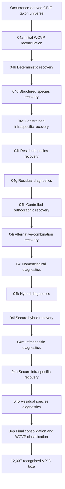

# VPJD Taxonomic Reconciliation

## Scope

This document summarises the staged taxonomic reconciliation used to construct the recognised taxonomic backbone underlying **Vascular Plants of Japan Database (VPJD): Taxonomic Release v1.0.0**.

The authoritative frozen data release is available from Zenodo:

- **Taxonomic Release v1.0.0:** https://doi.org/10.5281/zenodo.23017356

This document describes the computational provenance of that release. It does not replace the versioned Zenodo dataset.

## Starting point and taxonomic authority

The reconciliation starts from an occurrence-derived taxon universe constructed from GBIF taxon concepts represented by **PRESENT occurrence records from Japan**. Each source concept is identified by a stable `vpjd_taxon_universe_id`.

The **World Checklist of Vascular Plants (WCVP)**, accessed through `rWCVPdata::wcvp_names`, is the taxonomic authority used for reconciliation.

The workflow is deliberately conservative:

- successful earlier resolutions are preserved unchanged;
- exact and deterministic evidence is preferred;
- progressively more specialised recovery is applied only to unresolved residual concepts;
- ambiguous evidence remains unresolved rather than being forced to a taxon;
- general fuzzy or edit-distance matching is not used;
- diagnostic stages are separated from stages permitted to assign a taxonomic resolution;
- source concepts are retained for audit even when they cannot be placed in the recognised taxonomic backbone.

## Reconciliation workflow



## Initial WCVP reconciliation — 04a

The initial reconciliation compares the complete GBIF `scientificName` with WCVP nomenclatural names. WCVP is treated as the taxonomic authority, and reconciliation is performed conservatively without fuzzy matching.

Unique exact matches are classified according to WCVP taxonomic status. Accepted WCVP names remain accepted, while exact matches to WCVP synonyms or other non-accepted names are linked through `accepted_plant_name_id` to the corresponding accepted WCVP concept.

Unmatched, ambiguous and higher-rank source concepts are retained for subsequent processing rather than discarded.

## Deterministic recovery — 04b

Species and infraspecific concepts unresolved after 04a are evaluated using three ordered recovery routes:

1. **R1 — full-name exact:** normalised GBIF `scientificName` equals the complete WCVP name including authorship;
2. **R2 — taxon-name exact:** normalised GBIF `scientificName` equals WCVP `taxon_name`, with compatible rank;
3. **R3 — species-field exact:** normalised GBIF `species` equals WCVP `taxon_name`, with compatible rank.

For each source concept, the highest-priority route producing candidates is used. Automatic recovery requires convergence on exactly one accepted WCVP concept. Where multiple accepted concepts remain possible, the source concept remains ambiguous.

Successful 04a resolutions are preserved unchanged.

## Structured species and infraspecific recovery — 04d–04e

Stage 04d applies exact matching of the GBIF species field against WCVP species-rank names.

For species-rank source concepts, a unique accepted WCVP species can provide a taxonomic resolution. For unresolved subspecies, varieties and forms, the same evidence may identify an accepted parent species, but this is retained as parent-species evidence rather than being treated as resolution of the infraspecific concept.

Stage 04e subsequently restricts the WCVP search to the identified parent-species concept and evaluates compatible infraspecific epithet and rank.

A unique accepted WCVP concept is required for recovery.

An unresolved infraspecific concept is therefore **not automatically collapsed to its parent species**.

## Residual species recovery — 04f

Remaining unresolved species-rank concepts are evaluated hierarchically using exact evidence:

1. full scientific name including authorship;
2. scientific-name binomial;
3. GBIF species field.

Weaker stages are considered only where stronger stages produce no candidates.

Where matching nomenclatural records converge on one accepted WCVP concept, that concept can be recovered. Ambiguous evidence remains unresolved.

## Residual diagnostics and controlled recovery — 04g–04i

Residual concepts are subjected to further diagnostic assessment before additional recovery.

Stage 04h applies a small, explicitly enumerated set of controlled orthographic transformations. Recovery requires exact same-genus WCVP evidence converging on a single accepted concept.

Stage 04i addresses genuine alternative combinations where the GBIF species field represents a different genus combination. Recovery requires the alternative binomial to match WCVP exactly and all matching evidence to converge on a single accepted WCVP concept.

These stages are deterministic recovery procedures rather than general spelling-correction or fuzzy-matching algorithms.

## Nomenclatural and hybrid treatment — 04j–04l

Stage 04j is diagnostic only. It investigates residual nomenclatural patterns without assigning new WCVP concepts.

Stage 04k similarly diagnoses unresolved explicit named hybrids and nothotaxa using conservative exact matching routes. Diagnostic evidence is separated from taxonomic assignment.

Stage 04l promotes only secure hybrid resolutions established by the preceding diagnostic stage.

This recovered:

- **35 source concepts**
- representing **1,364 PRESENT occurrence records**

No ambiguous, review-only or Artificial Hybrid diagnostic outcome is automatically promoted through this recovery route.

## Residual infraspecific treatment — 04m–04n

Stage 04m is diagnostic only. It examines unresolved subspecies, varieties and forms using controlled WCVP evidence.

Weak family-only evidence is explicitly excluded from secure recovery.

Stage 04n promotes only the secure infraspecific resolutions established by 04m.

This recovered:

- **247 source concepts**
- representing **21,444 PRESENT occurrence records**

Following 04n, the reconciliation comprised:

- **21,165** source concepts;
- **19,682** source concepts linked to final WCVP identifiers;
- **1,483** unresolved source concepts;
- **12,053** distinct final WCVP identifiers.

## Final consolidation and classification — 04p

Stage 04p consolidates the reconciled source concepts and classifies their final WCVP status.

The resulting WCVP concepts comprised:

| WCVP classification | Taxa |
|---|---:|
| Accepted | 12,006 |
| Artificial Hybrid | 31 |
| Unplaced | 16 |
| **Total distinct final WCVP identifiers** | **12,053** |

For VPJD v1.0.0, the recognised taxonomic universe is defined as:

**Accepted + Artificial Hybrid**

therefore:

**12,006 + 31 = 12,037 recognised VPJD taxa**

Unplaced WCVP concepts are retained for audit but excluded from the recognised VPJD taxonomic universe.

Unresolved source concepts are likewise retained in the reconciliation provenance rather than being silently discarded.

## Source concepts and recognised taxa

The **21,165 source concepts** represent occurrence-derived GBIF taxon concepts and should not be interpreted as 21,165 distinct plant taxa.

Multiple source concepts may reconcile to the same WCVP concept.

The source-concept layer therefore preserves the provenance of the occurrence-derived input, while the recognised taxonomic backbone represents the deduplicated, WCVP-aligned taxon universe used by VPJD.

The principal reconciliation arithmetic is therefore:

```text
21,165 occurrence-derived source concepts
                 |
                 v
19,682 linked to final WCVP identifiers
 1,483 unresolved source concepts
                 |
                 v
12,053 distinct final WCVP identifiers
                 |
        +--------+---------+
        |                  |
        v                  v
12,037 recognised       16 Unplaced
        |
   +----+----+
   |         |
   v         v
12,006      31
Accepted   Artificial Hybrid
```

## Reconciliation principles

Across the workflow, the principal methodological rules are:

1. **WCVP is the taxonomic authority.**
2. **Exact evidence is preferred over progressively weaker evidence.**
3. **Successful earlier resolutions are preserved.**
4. **Later stages operate primarily on unresolved residual concepts.**
5. **Automatic recovery requires deterministic convergence on a single WCVP concept.**
6. **Ambiguity is retained rather than resolved arbitrarily.**
7. **General fuzzy and edit-distance matching are not used.**
8. **Diagnostic candidate generation is separated from taxonomic assignment where appropriate.**
9. **Infraspecific concepts are not automatically collapsed to parent species.**
10. **Source concepts and unresolved evidence are retained to preserve provenance and auditability.**

## Release validation

The frozen Taxonomic Release v1.0.0 is independently checked using:

`release_02_validate_taxonomic_v1.0.0.R`

Post-release validation confirmed:

- **12,037 recognised taxon rows**;
- **12,037 distinct WCVP identifiers**;
- no missing or duplicated recognised WCVP identifiers;
- no missing taxon names, ranks or taxonomic-status fields;
- **18/18 SHA-256 checksums** matched;
- all populated recognised WCVP identifiers tested from the source-concept crosswalk were represented in the recognised taxonomic backbone.

These checks validate the frozen release independently of the historical construction workflow.

## Reproducibility

The repository contains the analytical and validation workflows used to develop VPJD.

The current development pipeline should not be interpreted as a single-command reconstruction of the already frozen v1.0.0 release. Historical reconciliation scripts document the staged construction of the taxonomic backbone, while the release validator independently tests the integrity and internal consistency of the frozen published dataset.

See [`REPRODUCIBILITY.md`](../REPRODUCIBILITY.md) for the current reproducibility scope and limitations.

For citation and data reuse, the versioned Zenodo release remains authoritative.
